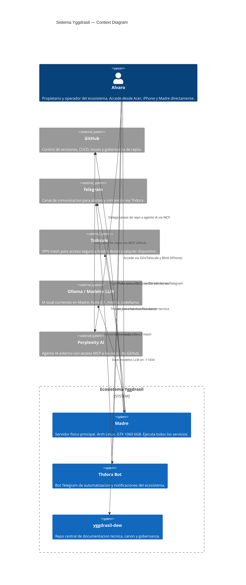
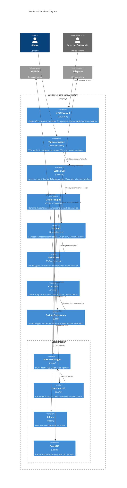

# Arquitectura C4 — Ecosistema Yggdrasil

> Diagramas C4 del ecosistema. Nivel 1 (Context) y Nivel 2 (Container).
> El modelo C4 (Simon Brown) organiza la arquitectura en 4 niveles de abstracción:
> Context → Container → Component → Code.
> Este documento cubre los dos niveles superiores, suficientes para comunicar
> la arquitectura a cualquier ingeniero externo.

---

## Nivel 1 — System Context

> Quién usa el sistema, qué sistemas externos interactúan con él.

---

## Nivel 2 — Container Diagram: Madre

> Qué procesos y servicios corren dentro de Madre y cómo se comunican.

---

## Notas de arquitectura

- **Tailscale como perimetro:** el único acceso externo autorizado a Madre es vía Tailscale. SSH directo desde internet no está permitido.
- **Docker como runtime:** todos los servicios de larga duración corren en contenedores excepto Ollama (systemd, necesita GPU directa) y Thdora (systemd, necesita acceso a filesystem).
- **Ollama en bare metal:** GPU passthrough no disponible en Docker sin configuración NVIDIA Container Toolkit — evaluado en ADR-003.
- **Agente IA externo (Perplexity):** accede solo a GitHub vía MCP, nunca a Madre directamente.

---

_Creado: 2026-07-06 · Fase 5 Plan de Alineación · Referencia: [C4 model](https://c4model.com) · [Mermaid C4](https://mermaid.js.org/syntax/c4.html)_
