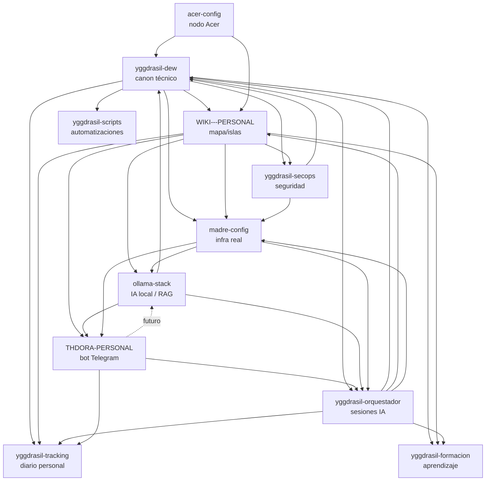

# MAPA-CONEXIONES — Ecosistema Yggdrasil

Actualizado: 2026-07-18 01:34 CEST  
Fuente de verdad: `yggdrasil-dew`

---

## 1. Núcleo canónico

### `yggdrasil-dew`
**Rol:** canon técnico y operativo del ecosistema.

Contiene:
- ADRs
- Protocolos
- ESTADO-SISTEMA.md
- MASTER-PENDIENTES.md
- runbooks
- auditorías
- sesiones técnicas

**Es la fuente de verdad.**
Ningún otro repo decide por encima de DEW.

---

## 2. Repos vivos y relación

| Repo | Rol | Relación principal |
|---|---|---|
| `yggdrasil-dew` | Canon técnico | Centro del sistema |
| `WIKI---PERSONAL` | Mapa de conocimiento estático | Traduce el canon a visión/islas |
| `yggdrasil-tracking` | Diario personal y tracking vital | Alimenta el lado humano del sistema |
| `yggdrasil-formacion` | Aprendizaje técnico | Conecta con labs, secops e IA local |
| `yggdrasil-orquestador` | Arranque/cierre de sesiones | Coordina agentes usando DEW |
| `madre-config` | Infraestructura real versionada | Materializa servicios y stacks |
| `yggdrasil-secops` | Seguridad ofensiva/defensiva | Protege y audita infraestructura |
| `THDORA-PERSONAL` | Bot personal Telegram | Puente personal hacia tracking/orquestador |
| `ollama-stack` | IA local / modelos / RAG | Da músculo IA local al sistema |
| `yggdrasil-scripts` | Automatizaciones reutilizables | Ejecuta tareas repetibles |
| `acer-config` | Config del laptop Acer | Nodo secundario del ecosistema |

---

## 3. Grafo simplificado

---

## 4. Relaciones reales por función

### Canon → todo
`yggdrasil-dew` define:
- cómo se abre una sesión
- cómo se cierra
- qué repo manda en cada decisión
- qué problemas están abiertos
- qué runbooks existen

### Wiki ← DEW
`WIKI---PERSONAL` **no sustituye** a DEW.
La wiki traduce el estado técnico en una visión navegable por islas.

### Tracking ← humano
`yggdrasil-tracking` es la capa personal.
Aquí viven diarios, energía, rutina, estado vital y trazabilidad humana.

### Orquestador ← DEW + contexto repo
`yggdrasil-orquestador` no inventa nada.
Solo garantiza que un agente arranca con:
- `BOOTSTRAP.md`
- `AGENT.md`
- `CONTEXT.md`
- protocolos de DEW

### THDORA ← puente personal
`THDORA-PERSONAL` no es el orquestador.
Es la interfaz personal vía Telegram.
Puede escribir en tracking, lanzar sesiones y recibir alertas.

### IA local ← músculo operativo
`ollama-stack` / `local-brain` es la capa que puede unificar contexto por RAG.
No decide, pero puede servir contexto a THDORA y al orquestador.

### Madre ← realidad física
`madre-config` es donde la infraestructura existe de verdad.
Todo lo demás acaba aterrizando aquí o depende de aquí.

---

## 5. Capas del ecosistema

| Capa | Repo principal | Función |
|---|---|---|
| Filosofía | WIKI + ADRs DEW | sentido y criterios |
| Canon | DEW | reglas, protocolos, deuda |
| Conocimiento | WIKI | mapa navegable |
| Vida personal | TRACKING | diarios y estado humano |
| Aprendizaje | FORMACIÓN | skill growth |
| Orquestación | ORQUESTADOR | sesiones IA consistentes |
| Ejecución | MADRE + SCRIPTS | servicios y tareas reales |
| Seguridad | SECOPS | protección y auditoría |
| IA local | OLLAMA-STACK | modelos y RAG |
| Interfaz humana | THDORA | acceso conversacional personal |

---

## 6. Tensión estructural sana

Yggdrasil funciona porque mantiene separadas pero conectadas estas tensiones:

- **canon** vs **vida real**
- **documentación** vs **infraestructura**
- **humano** vs **automatización**
- **mapa** vs **territorio**
- **Telegram/entrada rápida** vs **repo/versionado**

Cuando una cosa invade a otra, aparecen duplicados, deuda o caos.

---

## 7. Regla de lectura para agentes

Orden correcto para cualquier agente nuevo:

1. `yggdrasil-dew/ESTADO-SISTEMA.md`
2. `yggdrasil-dew/MASTER-PENDIENTES.md`
3. `docs/canon/PROTOCOLO-INICIO-SESION.md`
4. `BOOTSTRAP.md` del orquestador
5. `AGENT.md` del repo objetivo
6. `CONTEXT.md` del repo objetivo

---

## 8. Próxima evolución

Próximo salto estructural lógico:
- `local-brain` como servicio RAG del ecosistema
- THDORA como entrada conversacional personal
- Orquestador como capa formal de sesión
- DEW como fuente de verdad cerrando el circuito

---

_Archivo creado en F25 · 2026-07-18 · Perplexity-MCP_
