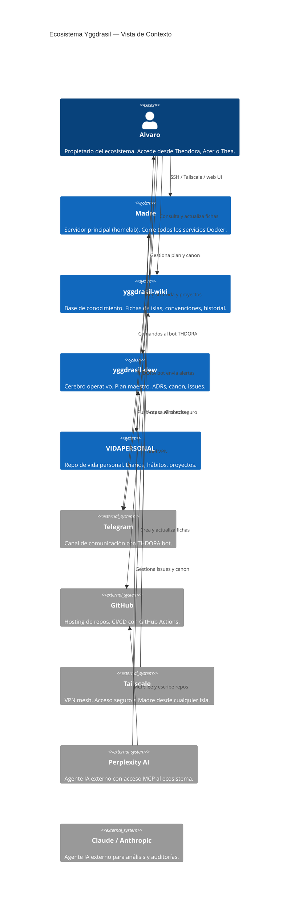
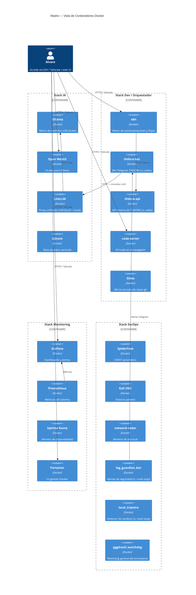

# Arquitectura C4 — Ecosistema Yggdrasil

> Diagrama C4 (Context + Container) del ecosistema completo.
> Mermaid renderiza en GitHub. Actualizar al cambiar topología.

Cierra: [DEW #41](https://github.com/alvarofernandezmota-tech/yggdrasil-dew/issues/41)

---

## Nivel 1 — Context (vista de usuario y sistemas externos)

---

## Nivel 2 — Container (servicios dentro de Madre)

---

## Decisiones de arquitectura relacionadas

- [ADR-001](../adr/) — Separación de repos por dominio
- [ADR-002](../adr/) — Docker como runtime único en Madre
- [Isla Orquestador](https://github.com/alvarofernandezmota-tech/yggdrasil-wiki/blob/main/wiki/islas/orquestador.md)
- [Isla Filosofía](https://github.com/alvarofernandezmota-tech/yggdrasil-wiki/blob/main/wiki/islas/filosofia.md) — Principio: Transparencia interna

---

_Creado: 2026-07-13 · Cierra #41 · Perplexity-MCP_
