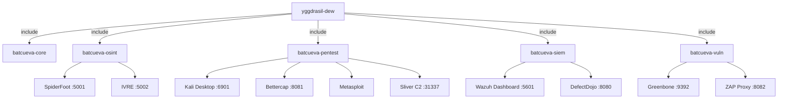

# Hoja de Ruta: Batcueva Nivel Ingeniería

> Secuencia de inversión de tiempo para llevar la Batcueva a nivel SecOps profesional.

---

## Arquitectura objetivo (Lab-as-Code)



---

## Fase 1 — GitOps (AHORA)

- [x] Estructura `docker/batcueva-*.yml` creada
- [x] Orquestador `batcueva-master.yml` con `include`
- [x] Script `batcueva-control.sh`
- [ ] Archivo `.env` centralizado con todos los puertos
- [ ] `.env.template` en repo (sin secretos), `.env` en `.gitignore`

## Fase 2 — Visibilidad (Próxima semana)

- [ ] Wazuh levantado en Madre (`sysctl` previo)
- [ ] Agente Wazuh instalado en Acer
- [ ] Script `scripts/bootstrap-node.sh` para instalar agente Wazuh en cualquier nodo nuevo
- [ ] Suricata con interfaz correcta configurada

## Fase 3 — Arsenal (2 semanas)

- [ ] Kali desktop funcional vía navegador
- [ ] Primer scan Nmap automatizado vía n8n
- [ ] DefectDojo con primer finding importado
- [ ] Guía de cámaras ejecutada en laboratorio

## Fase 4 — Documentación viva

- [ ] ADRs para cada decisión de arquitectura mayor (ver `docs/adr/`)
- [ ] Diagrama Mermaid de red completa en README principal
- [ ] Runbook de recuperación ante desastres (`scripts/bootstrap-madre.sh`)
- [ ] GitHub Actions: linter de YMLs en cada push

---

## Secretos y seguridad

Nunca credenciales en YMLs. Flujo correcto:

```bash
# 1. Copiar template
cp .env.template .env

# 2. Rellenar secretos en .env (ignorado por git)
vim .env

# 3. Los YMLs referencian variables del .env
# environment:
#   - PASSWORD=${WAZUH_ADMIN_PASSWORD}
```

**Pendiente crear:** `.env.template` con todos los puertos y contraseñas de la Batcueva.

---

## Referencias benchmark

| Repo | Lección |
|------|--------|
| [geerlingguy/ansible-role-kali](https://github.com/geerlingguy) | Ansible sobre Bash para infra resiliente |
| [OWASP/juice-shop](https://github.com/juice-shop/juice-shop) | Documentation-as-code, Dockerfiles limpios |
| [awesome-selfhosted](https://github.com/awesome-selfhosted/awesome-selfhosted) | Categorización de herramientas |

---
_Gemini 2026-06-25 | Revisado Perplexity 2026-06-25_
