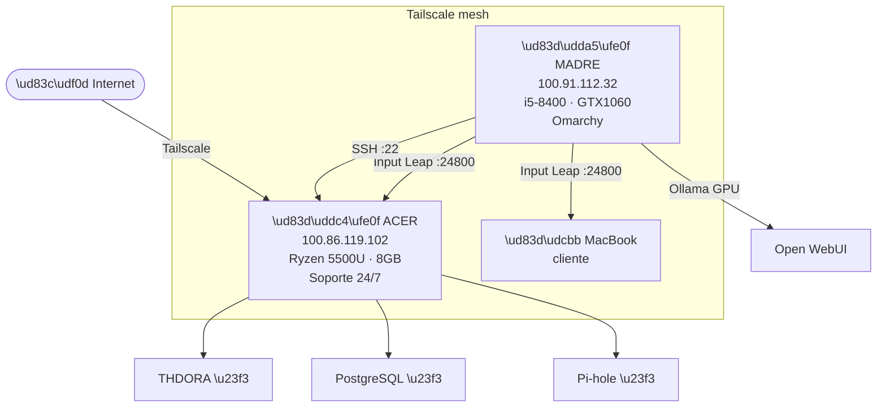

# Servidor Casa — Arquitectura y Estado

> Infraestructura doméstica de Álvaro Fernández Mota.
> 100% open source · Zero Trust · Auditado con Git
> Última actualización: 12 junio 2026

---

## Decisión de arquitectura (fijada 12 jun 2026)

**Madre es el cerebro. Acer es el soporte — dentro y fuera de casa.**

| Principio | Detalle |
|---|---|
| **Todo corre en Madre** | Trabajo, código, IAs, escritorio, GPU |
| **Acer quita peso a Madre** | Absorbe servicios que no necesitan GPU ni intervención manual |
| **Acer = acceso interno y externo** | Servicios 24/7 accesibles desde LAN y desde fuera vía Tailscale |
| **MacBook = cliente puro** | Solo consume servicios, no expone ni aloja nada |

### Qué corre dónde

| Servicio | Máquina | Estado |
|---|---|---|
| Input Leap server | Madre | ✅ Fase 1 completada |
| Tailscale | Madre + Acer | ✅ Fase 1 completada |
| SSH Madre → Acer | Acer | ✅ Fase 1 completada |
| UFW Zero Trust | Acer | ✅ Fase 1 completada |
| Input Leap client | Acer | ✅ Fase 1 completada |
| Ollama + Open WebUI | Madre (GTX 1060) | ⏳ Fase 3 |
| THDORA | Acer | ⏳ Fase 3 |
| PostgreSQL | Acer | ⏳ Fase 3 |
| Pi-hole | Acer | ⏳ Fase 3 |

---

## Arquitectura visual



---

## Roadmap

```
FASE 1 — Conectividad ✅ COMPLETADA (12 jun 2026)
  ✔ Tailscale en Madre (100.91.112.32) + Acer (100.86.119.102)
  ✔ SSH Madre → Acer por IP Tailscale
  ✔ Input Leap server en Madre, client en Acer
  ✔ UFW Zero Trust en Acer

FASE 2 — Seguridad (próximo)
  □ TLS en Input Leap (openssl self-signed)
  □ fail2ban en Acer
  □ Headscale self-hosted (sustituye Tailscale cloud)
  □ Auditoría semanal de logs

FASE 3 — Servicios
  □ Ollama + Open WebUI en Madre (GTX 1060)
  □ PostgreSQL en Acer
  □ THDORA migrado a Acer
  □ Pi-hole en Acer
```

---

## Archivos de configuración

| Archivo | Descripción |
|---|---|
| `tailscale.md` | IPs reales + instalación + fix NeedsLogin |
| `barrier.md` | Input Leap: configs systemd + UFW |
| `lan.md` | Mapa de red, IPs, puertos |
| `ollama.md` | Docker Compose LLM local (Fase 3) |

---

_Frecuencia de actualización: al cambiar configuración o estado de cualquier servicio._
