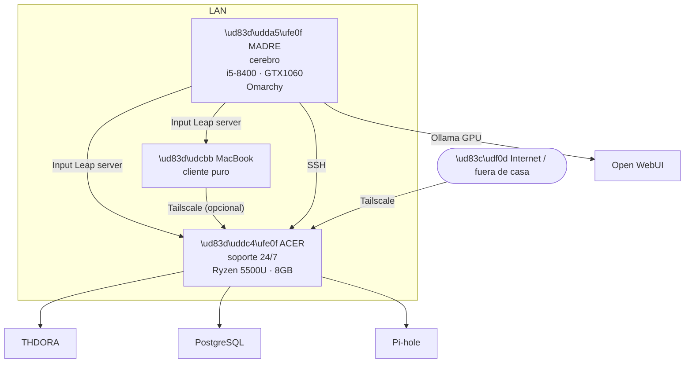

# Servidor Casa — Arquitectura y Estado

> Infraestructura doméstica de Álvaro Fernández Mota.
> 100% open source · Zero Trust · Auditado con Git
> Última actualización: 12 junio 2026

---

## Decisión de arquitectura (fijada 12 jun 2026)

**Madre es el cerebro. Acer es el soporte — dentro y fuera de casa.**

| Principio | Detalle |
|---|---|
| **Todo corre en Madre** | Trabajo, código, IAs, escritorio, GPU |
| **Acer quita peso a Madre** | Absorbe servicios que no necesitan GPU ni intervención manual |
| **Acer = acceso interno y externo** | THDORA, PostgreSQL, Pi-hole accesibles desde LAN y desde fuera vía Tailscale |
| **MacBook = cliente puro** | Solo consume servicios, no expone ni aloja nada |
| **Madre = siempre ágil** | Sin servicios pesados en segundo plano |

### Qué corre dónde

| Servicio | Máquina | Por qué |
|---|---|---|
| Trabajo diario, código, IDE | **Madre** | Es la workstation |
| Ollama + Open WebUI (LLM) | **Madre** | Necesita GTX 1060 |
| Input Leap (servidor) | **Madre** | Emite teclado+ratón |
| Input Leap (cliente) | **Acer + MacBook** | Reciben entrada |
| THDORA (bot Telegram) | **Acer** | 24/7, acceso interno y externo |
| PostgreSQL | **Acer** | 24/7, acceso interno y externo |
| Pi-hole (DNS) | **Acer** | 24/7, crítico para toda la LAN |
| Tailscale | **Madre + Acer** | IPs fijas — MacBook opcional |
| fail2ban + logs | **Acer** | Seguridad siempre activa |
| Acceso remoto (fuera de casa) | **Acer vía Tailscale** | Acer es la puerta de entrada |

---

## Los tres roles

```
🖥️  MADRE — cerebro
     Workstation + GPU + Input Leap server
     Todo lo que requiere intervención humana o GPU

🗄️  ACER — soporte (dentro Y fuera de casa)
     Servicios 24/7 accesibles desde LAN y desde internet vía Tailscale
     THDORA + PostgreSQL + Pi-hole + fail2ban
     Cuando estás fuera de casa → entras al Acer, no al MacBook

💻  MacBook — cliente puro
     Consume servicios del Acer desde fuera si hace falta
     Input Leap client (teclado/ratón de Madre cuando está en LAN)
     No aloja nada, no expone nada
```

---

## Arquitectura visual



---

## Estado de servicios

| Servicio | Máquina | Estado | Archivo |
|---|---|---|---|
| **Tailscale** | Madre + Acer | ⏳ Instalar (Fase 1) | `tailscale.md` |
| **SSH Madre → Acer** | Acer | ⏳ Instalar (Fase 1) | — |
| **Input Leap** | Madre → Acer + Mac | ⏳ Instalar (Fase 1) | `barrier.md` |
| **Ollama + Open WebUI** | Madre (GTX 1060) | ⏳ Fase 3 | `ollama.md` |
| **PostgreSQL** | Acer | 🔄 Migrando | — |
| **THDORA** | Acer | 🔄 Migrando | `../../proyectos/thdora.md` |
| **Pi-hole** | Acer | ⏳ Fase 3 | — |

---

## Roadmap

```
FASE 1 — Conectividad (AHORA)
  ├── Tailscale en Madre + Acer → IPs fijas 100.x.x.x
  ├── SSH Madre → Acer funcionando
  └── Input Leap: server en Madre, client en Acer+Mac, UFW Zero Trust

FASE 2 — Seguridad
  ├── TLS en Input Leap
  ├── fail2ban en Acer
  └── Headscale self-hosted (sustituye Tailscale cloud)

FASE 3 — Servicios
  ├── Ollama + Open WebUI en Madre
  ├── PostgreSQL consolidado en Acer
  ├── THDORA migrado a Acer
  └── Pi-hole en Acer
```

---

## Red

| Máquina | IP LAN | IP Tailscale | Rol |
|---|---|---|---|
| Ordenador Madre | pendiente fijar | pendiente | Cerebro |
| Acer Aspire | 10.176.119.171 | pendiente | Soporte + puerta exterior |
| MacBook | 10.176.119.229 | opcional | Cliente puro |

---

_Frecuencia de actualización: al cambiar configuración o estado de cualquier servicio._
